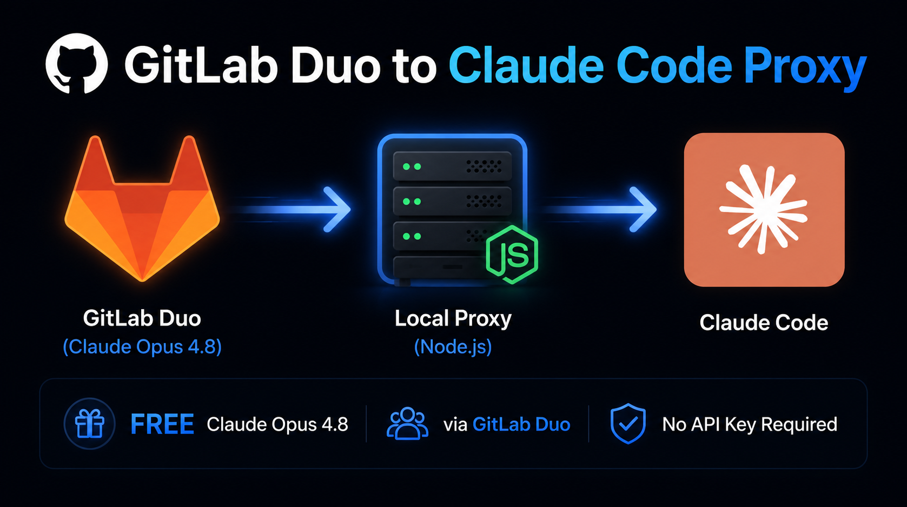

<p align="center">
  
</p>

<h1 align="center">GitLab Duo ⇄ Claude Code Proxy</h1>

<p align="center">
  <strong>Use Claude Opus 4.8 for FREE in Claude Code — via GitLab Duo's 30-day Ultimate trial. No credit card required.</strong>
</p>

<p align="center">
  <a href="https://github.com/Jaimin-prajapati-ds/gitlab-claude-proxy/stargazers">
    
  </a>
  <a href="https://github.com/Jaimin-prajapati-ds/gitlab-claude-proxy/issues">
    
  </a>
  
  
  
  
</p>

> [!TIP]
> **Enjoying this tool?** Don't forget to **Star ⭐ this repository** on GitHub to show your support and help other developers find it!

---

## ✨ Features

- 🚀 **Zero External Dependencies** — Pure Node.js standard library (`no npm install` needed)
- ⚡ **Real-time Streaming (SSE)** — Renders Claude Code's responses instantly line-by-line
- 🧠 **Smart Prompt Filtering** — Automatically strips massive system-reminder injections to stay within context limits
- 📁 **Dynamic CWD Resolution** — Auto-routes to your active Git workspace for correct project context
- 🪟 **Silent Background Runner** — Starts hidden on Windows with no terminal window clutter
- 🌐 **Cross-Platform** — Works on Windows, macOS, and Linux

---

## Step-by-Step Setup

### Prerequisites
- **Node.js** (v16+) installed.
- **Git** installed.
- **Claude Code CLI** installed (`npm install -g @anthropic-ai/claude-code`).

---

### Step 1: Claim your GitLab Ultimate 30-Day Free Trial
1. Go to [GitLab.com](https://gitlab.com) and create a new account.
2. Once registered, start a 30-day **GitLab Ultimate Free Trial** (available for personal namespaces or groups).
3. **No credit card is required**—just complete the email verification and start the trial.

---

### Step 2: Install and Log in with GitLab CLI (`glab`)
1. **Install the CLI**:
   - **Windows**: `winget install GitLab.GLAB` (or download from GitHub Releases)
   - **macOS**: `brew install glab`
   - **Linux**: Use your package manager (e.g., `sudo apt install glab` or `sudo dnf install glab`)
2. **Authenticate the CLI**:
   - Run: `glab auth login`
   - Select `gitlab.com`
   - Choose your preferred protocol (HTTPS/SSH)
   - Authenticate via browser or paste a personal access token (ensure `api` and `read_user` scopes are checked).

---

### Step 3: Test GitLab Duo in a Repository
Because the GitLab CLI requires a Git project workspace context:
1. Open any Git repository on your machine.
2. Run the following command:
   ```bash
   glab duo cli run --model claude_opus_4_8 --goal "Say hello and confirm you are working."
   ```
3. If it outputs a response from Claude, you are ready to configure the proxy!

---

### Step 4: Configure the Proxy (Automated & Manual Setup)

Clone or download this repository to a folder of your choice (e.g., `~/gitlab-claude-proxy`).

#### Option A: Windows Automated Setup
1. Open PowerShell and navigate to the proxy folder.
2. Run the installer script:
   ```powershell
   Set-ExecutionPolicy Bypass -Scope Process
   .\setup.ps1
   ```
3. Restart your PowerShell terminal or run `. $PROFILE` to apply configuration.
4. Run `cg` inside any Git repository to launch Claude Code with GitLab Duo!

#### Option B: macOS & Linux Automated Setup
1. Open your terminal (Bash or Zsh) and navigate to the proxy folder.
2. Make the installer script executable and run it:
   ```bash
   chmod +x setup.sh
   ./setup.sh
   ```
3. Restart your terminal session or reload your shell profile (e.g., `source ~/.zshrc` or `source ~/.bashrc`).
4. Run `cg` inside any Git repository to launch Claude Code!

#### Option C: Manual Setup (Cross-Platform / Custom Shells)

##### 1. Configure Claude Code Settings
Create or modify your Claude Code settings file at `~/.claude/settings.json`:
```json
{
  "env": {
    "ANTHROPIC_BASE_URL": "http://127.0.0.1:3456",
    "ANTHROPIC_API_KEY": "gitlab-proxy",
    "ANTHROPIC_AUTH_TOKEN": "gitlab-proxy",
    "CLAUDE_CODE_DISABLE_NONESSENTIAL_TRAFFIC": "1",
    "MAX_THINKING_TOKENS": 8192
  },
  "permissions": {
    "allow": [],
    "deny": []
  },
  "model": "claude-opus-4-8",
  "effortLevel": "xhigh"
}
```

##### 2. Launch the Proxy Server
In the proxy directory, run:
```bash
node server.js
```
The server will start listening at `http://127.0.0.1:3456`.

##### 3. Run Claude Code
Define the environment variables in your active terminal:
```bash
# Bash / Zsh
export ANTHROPIC_BASE_URL="http://127.0.0.1:3456"
export ANTHROPIC_API_KEY="gitlab-proxy"
claude --model claude-opus-4-8

# Command Prompt (cmd)
set ANTHROPIC_BASE_URL=http://127.0.0.1:3456
set ANTHROPIC_API_KEY=gitlab-proxy
claude --model claude-opus-4-8
```

---

## Daily Usage & Shortcuts (Cross-Platform)

If you completed the automated setup (Option A or B), the following commands are added to your environment:

- `cg [arguments]`: Automatically saves your current directory path to `~/.cg-cwd.txt`, starts the Node proxy silently in the background if it isn't running, and launches Claude Code.
  - *Example*: `cg --print "write a quick python script to parse a csv"`
- `stop-proxy`: Stops and kills the background Node.js proxy server.
- `restart-proxy`: Force restarts the background Node.js proxy server.

---

## 🔄 Auto-Start on System Boot (Optional)

### 1. The `cg` Alias (No Setup Needed)
If you use the **`cg`** alias to run Claude Code, **you do not need to configure anything**. The `cg` command automatically checks if the proxy is running and starts it silently in the background whenever you run it.

### 2. Auto-Run on OS Boot (For Direct `claude` CLI Usage)
If you want to use the standard `claude` command directly instead of `cg` and want the proxy to always be running in the background automatically when your computer starts:

#### 🪟 Windows Setup:
1. Press `Win + R`, type `shell:startup` and press **Enter**. This opens your Startup folder.
2. Right-click inside the folder and select **New** -> **Shortcut**.
3. In the location field, enter:
   ```cmd
   wscript.exe "C:\Path\To\Your\gitlab-claude-proxy\start-hidden.vbs"
   ```
   *(Be sure to replace `C:\Path\To\Your\gitlab-claude-proxy` with the absolute path where you downloaded this repository)*.
4. Click **Next**, name the shortcut `GitLab Duo Proxy`, and click **Finish**.

#### 🍎 macOS Setup:
You can register a background LaunchAgent to start the proxy on login:
1. Create a file named `com.gitlab-claude-proxy.plist` in `~/Library/LaunchAgents/` with the following content:
   ```xml
   <?xml version="1.0" encoding="UTF-8"?>
   <!DOCTYPE plist PUBLIC "-//Apple//DTD PLIST 1.0//EN" "http://www.apple.com/DTDs/PropertyList-1.0.dtd">
   <plist version="1.0">
   <dict>
       <key>Label</key>
       <string>com.gitlab-claude-proxy</string>
       <key>ProgramArguments</key>
       <array>
           <string>/usr/local/bin/node</string>
           <string>/Users/YOUR_USER_NAME/gitlab-claude-proxy/server.js</string>
       </array>
       <key>RunAtLoad</key>
       <true/>
       <key>KeepAlive</key>
       <true/>
   </dict>
   </plist>
   ```
   *(Replace `/usr/local/bin/node` with your actual Node path from `which node`, and `/Users/YOUR_USER_NAME/...` with the absolute path to your `server.js`)*.
2. Load the LaunchAgent by running:
   ```bash
   launchctl load ~/Library/LaunchAgents/com.gitlab-claude-proxy.plist
   ```

#### 🐧 Linux Setup (systemd User Service):
1. Create a directory for user services:
   ```bash
   mkdir -p ~/.config/systemd/user/
   ```
2. Create `~/.config/systemd/user/gitlab-claude-proxy.service` with:
   ```ini
   [Unit]
   Description=GitLab Duo to Claude Code Proxy
   After=network.target

   [Service]
   ExecStart=/usr/bin/node /home/YOUR_USER_NAME/gitlab-claude-proxy/server.js
   Restart=always

   [Install]
   WantedBy=default.target
   ```
   *(Replace paths to `node` and `server.js` with your system's actual absolute paths)*.
3. Enable and start the service:
   ```bash
   systemctl --user daemon-reload
   ```
   ```bash
   systemctl --user enable gitlab-claude-proxy.service --now
   ```

---

## How it Works Under the Hood

```
┌─────────────┐                      ┌─────────────┐                      ┌────────────┐
│             │   Anthropic API API  │             │   Executes glab cli  │            │
│ Claude Code │  ─────────────────>  │ Local Proxy │  ─────────────────>  │ GitLab Duo │
│     CLI     │  <─────────────────  │ (server.js) │  <─────────────────  │ (via SaaS) │
│             │    Streamed (SSE)    │             │   Parsed Output      │            │
└─────────────┘                      └─────────────┘                      └────────────┘
```

1. **Model Discovery**: Claude Code probes the endpoint `/v1/models` on startup. The proxy returns a mockup model list featuring `claude-opus-4-8`.
2. **Context Filtering**: Claude Code transmits large system prompts. The proxy parses the messages array and extracts only the last active user query (`extractUserGoal`).
3. **Piped Stream**: The proxy passes the goal via the `DUO_WORKFLOW_GOAL` environment variable (to bypass command-line length limits on Windows) and invokes `glab duo cli run`.
4. **SSE Streaming Interface**: The proxy intercepts stdout/stderr, extracts the assistant response content block, and chunks it back to Claude Code using standard Server-Sent Events (SSE).

---

## Troubleshooting

### ❌ `glab duo cli run` command not found
- Make sure `glab` is properly installed and accessible in your PATH.
- Run `glab --version` to verify. If it fails, reinstall it:
  - **Windows**: `winget install GitLab.GLAB`
  - **macOS**: `brew install glab`
  - **Linux**: `sudo apt install glab` or download from [GitLab CLI releases](https://gitlab.com/gitlab-org/cli/-/releases)
- After installing, restart your terminal.

---

### ❌ `glab duo cli run` says "403 Forbidden" or "Unauthorized"
- Your GitLab account does not have an **Ultimate plan** or your trial has expired.
- Go to [gitlab.com/-/trials](https://gitlab.com/-/trials) and start/renew the 30-day Ultimate trial.
- After activating, run `glab auth logout` then `glab auth login` to refresh your session.

---

### ❌ `glab duo cli run` says "not inside a git repository"
- GitLab Duo requires a valid Git project folder context.
- Always run `cg` (or the proxy) from **inside a git repository** (a folder with a `.git` directory).
- To initialize a test repo anywhere:
  ```bash
  mkdir my-test && cd my-test && git init
  ```
  Then run `cg` from inside `my-test`.

---

### ❌ Proxy starts but Claude Code says "connection refused" or "API error"
- Make sure the proxy is running: Open a browser and visit `http://localhost:3456/v1/models` — it should return a JSON list.
- If it doesn't respond, start the proxy manually:
  ```bash
  node server.js
  ```
- Then in another terminal, run `claude --model claude-opus-4-8`.

---

### ❌ Claude Code gives empty or garbled responses
- This is usually a GitLab Duo parsing issue. The proxy tries multiple strategies to extract the response.
- Try running the raw command to see what GitLab returns:
  ```bash
  glab duo cli run --model claude_opus_4_8 --goal "Say hello"
  ```
- If the output is blank or an error, the issue is on the GitLab Duo side (check your trial status).

---

### ❌ Windows: `cg` command not recognized
- Make sure `setup.ps1` ran successfully and the profile was updated.
- Reload your profile: `. $PROFILE`
- Or restart PowerShell completely.
- Verify the `cg` function exists: `Get-Command cg`

---

### ❌ macOS/Linux: `cg` command not recognized
- Make sure `setup.sh` ran and your shell profile (`.zshrc` or `.bashrc`) was updated.
- Reload it: `source ~/.zshrc` or `source ~/.bashrc`
- Verify `cg` exists: `type cg`

---

### ❌ `setup.ps1` gives "ExecutionPolicy" error on Windows
Run this first in PowerShell:
```powershell
Set-ExecutionPolicy Bypass -Scope Process
```
Then re-run `.\setup.ps1`.

---

### ❌ Claude Code keeps asking for an API key / "Invalid API key"
- Make sure `~/.claude/settings.json` exists and has the correct content (run `setup.ps1` or `setup.sh` again).
- Or manually set environment variables before launching:
  ```bash
  export ANTHROPIC_BASE_URL="http://127.0.0.1:3456"
  export ANTHROPIC_API_KEY="gitlab-proxy"
  claude --model claude-opus-4-8
  ```

---

### Still stuck?
Open an issue on the [GitHub repository](https://github.com/Jaimin-prajapati-ds/gitlab-claude-proxy/issues) with:
1. Your OS and Node.js version (`node --version`)
2. The exact error message
3. Output of `glab duo cli run --model claude_opus_4_8 --goal "test"`

---

## Disclaimers & Security

- **Completely Local**: The proxy server operates strictly on localhost (`127.0.0.1:3456`). No external entities receive your data except GitLab's official API endpoints.
- **Privacy Safe**: None of your local paths, personal names, or authentication keys are stored or shared.
- **Educational Use**: This project is for personal educational testing of Claude Code integrations. Use in compliance with GitLab's Terms of Service.

---

## AI Prompt Template

If you want to recreate or customize this setup using another AI assistant (like Cursor, Claude, ChatGPT, or Gemini), we have provided a ready-to-use prompt template in the [PROMPT.md](PROMPT.md) file.
